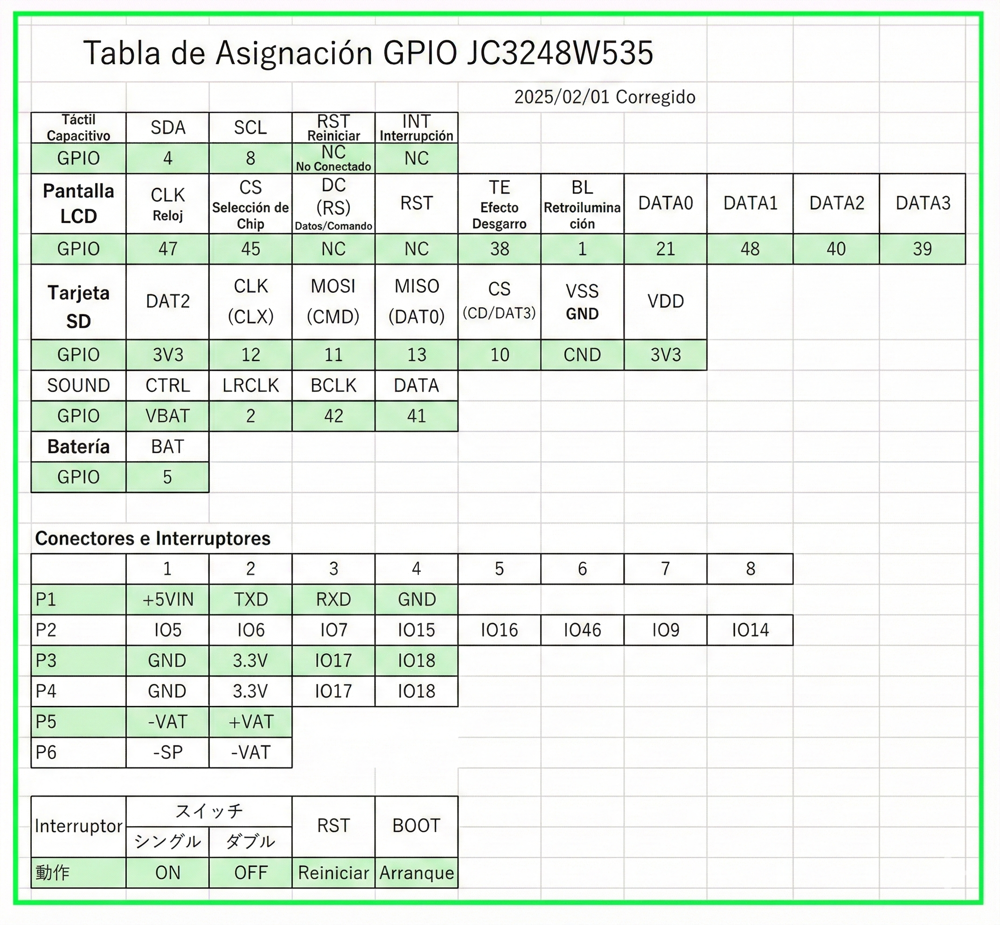
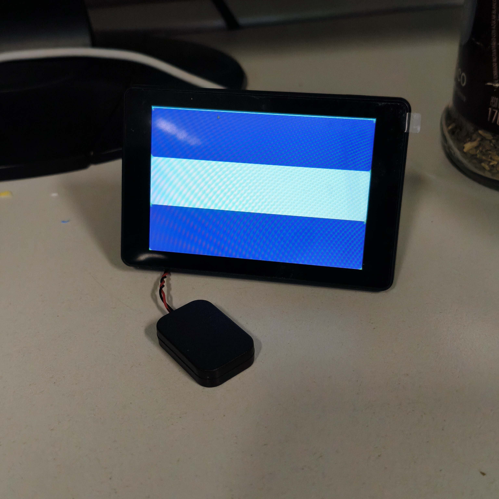

# Proyecto para pantalla JC3248W535EN con ESP-IDF

Este repositorio contiene la implementación y configuración necesaria para utilizar la placa de desarrollo con pantalla **JC3248W535EN** (basada en ESP32-S3) utilizando el framework nativo **ESP-IDF** de Espressif.

El objetivo de este proyecto es migrar y optimizar el funcionamiento de los periféricos (LCD, Táctil, Audio, SD) fuera del entorno de Arduino, aprovechando el control granular y el rendimiento que ofrece ESP-IDF.

## 🛠 Hardware

* **MCU:** ESP32-S3 (Módulo WROOM-1 N16R8: 16MB Flash / 8MB PSRAM Octal).
* **Pantalla:** 3.5" IPS (Interfaz QSPI / SPI de 4 líneas).
* **Resolución:** 320 x 480 píxeles.
* **Controlador Táctil:** Capacitivo (GT911).
* **Audio:** Codec I2S.
* **Almacenamiento:** Ranura para tarjeta TF (MicroSD).


## 🔌 Pinout (Asignación de GPIO)
La configuración de pines ha sido extraída de la documentación original y adaptada para ESP-IDF.




## ⚙️ Requisitos

* **ESP-IDF v5.0** o superior.
* Controlador de pantalla compatible (ej. `esp_lcd_panel_io_spi` configurado para Octal/QSPI).
* Biblioteca gráfica LVGL (opcional, para la interfaz de usuario).

## 🚀 Instalación y Uso

1.  **Clonar el repositorio:**
    ```bash
    git clone [https://github.com/tu-usuario/tu-repo.git](https://github.com/tu-usuario/tu-repo.git)
    cd tu-repo
    ```

2.  **Configurar el proyecto:**
    Asegúrate de configurar la Flash a 16MB y la PSRAM en modo Octal.
    ```bash
    idf.py menuconfig
    ```
    * *Component config -> ESP32S3-Specific -> Support for external, SPI-connected RAM -> SÍ*
    * *SPI RAM config -> Mode (Octal Mode PSRAM)*
     
     #### _Opcionalmente puedes usar mi configuracion copiando el contenido de configuracion_basica en sdkconfig_

3.  **Compilar y Flashear:**
    ```bash
    idf.py build flash monitor
    ```

## 🔗 Créditos y Referencias

Este proyecto se basa en la ingeniería inversa y la configuración de pines documentada originalmente para el entorno Arduino. Puedes encontrar el repositorio de referencia aquí:

* **Repositorio Arduino Original:** [NorthernMan54](https://github.com/NorthernMan54/JC3248W535EN)

Se ha portado la lógica de inicialización y configuración de hardware para cumplir con los estándares de FreeRTOS y la estructura de componentes de ESP-IDF.

---

---

## 📸 Galería

**Pantalla funcionando con ESP-IDF:**
<p align="center">
  
</p>